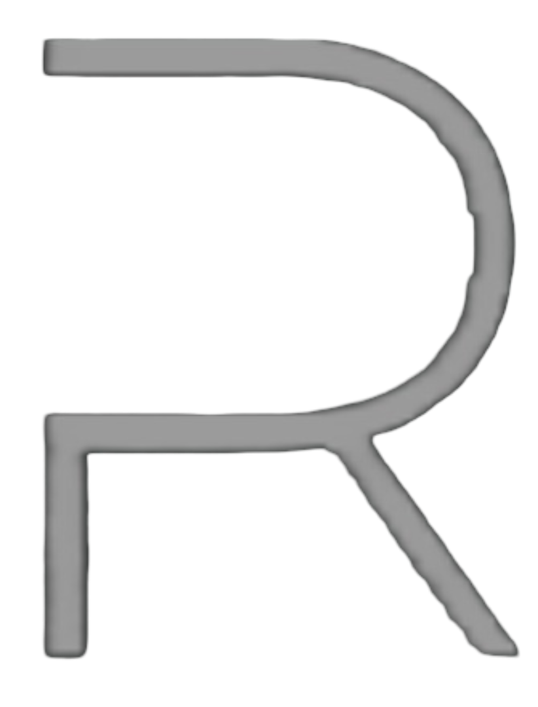

# Framelar

**Framelar** is a production startup building a marketplace for ready-to-use websites.

The goal is simple: help people launch faster by buying and selling websites that are already designed, structured, and close to production-ready.

Framelar is not a demo or a student project. It’s an actively developed product, built step by step with real users in mind.

---

## 🌱 Current Stage

Framelar is in **early production**.

Some core parts are already live, while others are still being built and refined. The focus right now is on getting the foundation right before opening everything at scale.

---

## ✨ What’s Live Right Now

- 🔐 **Authentication**
  - Secure sign-up and login
  - Stable and production-ready

---

## 🛠️ What’s Being Built

- 📊 **Dashboard**
  - User account overview
  - Purchase and activity management  
  *(currently under development)*

- 🏪 **Marketplace (Store Page)**
  - Shows a small number of websites for now
  - Structure is in place, but not final
  - More listings, filters, and improvements coming soon

---

## 🧭 Where Framelar Is Going

Framelar is being built with a long-term vision. Upcoming work includes:

- A complete website marketplace experience  
- Better discovery and browsing  
- Purchase and delivery flows  
- Tools for creators to upload and manage websites  
- Performance, security, and scaling improvements  

Everything is being developed gradually, with stability and user experience as the top priority.

---

## 🛠️ Tech Overview

Framelar runs on a modern, production-ready stack:

- Frontend built with a modern web framework  
- Backend APIs designed for scalability  
- Secure authentication  
- Production database and hosting infrastructure  

(The stack will evolve as the product grows.)

---

## 🌐 Access

Framelar is currently available in **limited access** while core features are finalized.  
A wider public release will follow once the marketplace experience is ready.

---

## 👤 Founder

Built and maintained by **Sanket Padhyal**  
Founder & Developer — Framelar

---

## 📄 License

© 2025 Framelar  
All rights reserved. This is proprietary software.
  
